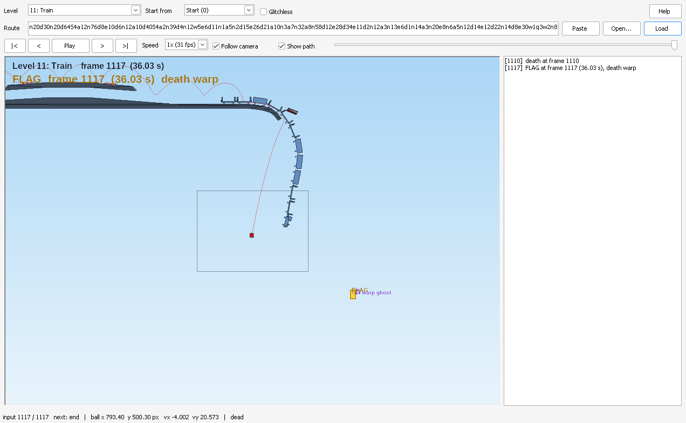

# rbsim — bit-exact Red Ball 1 simulator

A C++17 port of the Box2DFlash 2.0.x engine embedded in *Red Ball 1* (practice-hack / tournament
SWFs; their Box2D code is byte-identical), plus all of the game-side logic: the 17 level scripts,
display-layer hit tests, camera, standardized spikes, death and death warps. It is the foundation
for brute-force route search.

**Reference:** Flash Player **11.4.402.287** with the Practice Hack, `MATHSPIKES = 1`, spike glitch
on (`isGless` off; glitchless mode is supported too). "Bit-exact" means every logged value of every
frame matches that Flash Player to the last bit.

## Status

| | |
|---|---|
| levels | **all 17 bit-exact** against Flash logs: 83 logs, 99,170 frames, every death and win on Flash's frame |
| display layer | calibrated: rotation matrices, hit-test boxes, camera, plain spikes (E8c 30,000/30,000), turned/scaled spikes (E11 390,665/390,670, the other 5 flagged as uncertain), the turned Level 11 flag (E12 148,074/148,074) |
| death | death warps (onto checkpoints, flags, a moving flag, the Level 16 wrong-way trigger) and real-game pause timing |
| platforms | Linux and Windows (x86-64), identical results; `rbview.exe`: a double-click route viewer for Windows |
| search | `rbsim beam` (finds routes from any start, resumable), `rbsim optimize` (improves a known route) |
| tests | `rbsim test`: 86 self-tests |

## Route viewer (Windows, no command line)

**[⬇ Download rbview.exe](https://github.com/Theme25/project-unnamed/releases/latest/download/rbview.exe)**
(latest release; one file, no installer). Windows may show "Windows protected your PC" the first time
because the exe is not signed: click **More info**, then **Run anyway**.

`rbview.exe` is a single double-click program: pick a level, paste a route (or open/drag a route file
or a stats log), press Play. It draws the level, moving parts, spikes, checkpoints, switches, the flag
and the ball with the game's camera, lists deaths/checkpoints/switches/the flag frame, steps and seeks
frame by frame, and shows a "warp ghost" after a death so death warps are visible. Everything is
computed by the same bit-exact simulator. Guide: [`docs/WINDOWS.md`](docs/WINDOWS.md).
Build: `make viewer` (MinGW-w64 cross build; Win32 + GDI+, static, ~1.6 MB; source in `viewer/`).
To publish a new version: create a GitHub release (new tag, e.g. `v1.1`) and attach the exe named
exactly `rbview.exe`, so the download link above keeps pointing at the newest one
(`gh release create v1.1 rbview.exe --title "..." --notes "..."` does the same from the command line).



## Build & run

**Linux / WSL / Codespaces:** `make`. **Windows:** see [Windows](#windows) below, or
[`docs/WINDOWS.md`](docs/WINDOWS.md) to just use the ready-made exe.

```
make                 # see "Build flags" below; do not change them
./rbsim test         # 86 self-tests (physics, display layer, spikes, death warps, all 17 levels, snapshots, ...)
./rbsim run --level 2 --inputs "n20w1d25n40" [--hex] [--every N] [--checkpoint K]
./rbsim log --level 2 --inputs "..."      # simulator log in the Flash mod's TSV format
./rbsim bench [--frames N]                # throughput
./rbsim verify rb1_stats.tsv [--verbose N] [--ignore sr,...] [--gless 0|1] [--trig intel|glibc]
./rbsim calib rb1_calib.tsv                # checks a calibration dump (docs/STATS_LOGGING.md)
./rbsim optimize --level N --inputs RLE    # improve a known route, see below
./rbsim beam --level N --memory 10G        # find a route from any start, see below
make deathcause && tools/deathcause <level> <RLE> [checkpoint] [gless]   # what killed the ball, when
```

`run` prints position, velocity, angle, angular velocity, ground probes (L/C/R), contact count,
alive and sleep flags per frame (`--hex`: raw IEEE-754 bits). Inputs use the game's RLE format
(`n d w e a S q W` = none, right, up, up+right, left, left+right, left+up, all three, each followed by
a frame count; `R` = checkpoint restart).

`verify` replays a stats log recorded with the logging mod and compares every field of every frame.
It detects per segment whether the recording had `isGless` on (`--gless` forces it), and also
reports how many hit-test decisions came within a rounding unit of flipping (should be 0).

### Windows

**Just want to run it?** See [`docs/WINDOWS.md`](docs/WINDOWS.md).

Two ways to build, both giving a static `rbsim.exe` (no DLLs needed) with the same results as Linux:

1. **Native, with MSYS2:** install [MSYS2](https://www.msys2.org/), open the **MSYS2 UCRT64** shell, then
   ```
   pacman -S --needed mingw-w64-ucrt-x86_64-gcc make git
   git clone <repo> && cd project-unnamed
   make            # produces rbsim.exe
   ./rbsim.exe test
   ```
2. **Cross-compiled on Linux:** `apt install mingw-w64`, then `make windows`.

MSVC is not supported: Flash's `sin`/`cos` (`src/libm_intel.S`) is GNU assembly, wrapped on Windows
to preserve the registers the Windows x64 calling convention requires. The simulator does not depend
on the host's math library (it only uses exact functions: `sqrt`, `fmod`, `floor`, `trunc`).

Checked under Wine 9 after every change: all self-tests, the calibration dumps and the stats logs give
the same results as Linux. Seeded `optimize` and `beam` runs were checked to print identical routes
when those commands were added.

**Build flags:** use the Makefile's (`-O2 -ffp-contract=off -fno-fast-math
-fexcess-precision=standard`, `-pthread`). `-O3 -march=native` breaks bit-exactness on Levels 3, 8
and 12 and is not faster. Never add fast-math, FMA contraction or `-march` flags.

## Searching for faster routes: `rbsim optimize`

```
rbsim optimize --level N --inputs RLE [--checkpoint C] [--time SEC] [--threads N]
               [--seed S] [--sideways P] [--evals N] [--gless] [--quiet]
```

Starts from an existing route (one attempt, no `R`) and searches for edits that collect the flag
earlier. Each thread repeatedly applies a random edit to the current best route (flip a frame,
move a run boundary by 1-3 frames, delete or insert a frame, overwrite a 2-8 frame block, or two
of these), replays it from a cached snapshot taken just before the first changed frame, and stops
as soon as it can no longer match the best.

- **Score:** the flag frame; ties are broken by how deep the ball is inside the flag's box on that
  frame (deeper = closer to the next frame). Equal routes are accepted sideways with probability
  `--sideways` (default 0.05) to cross plateaus.
- **Death warps** count only if usable in a real run (flag no later than death + 38 frames); the
  output gives the pause/unpause frames.
- **Output:** each improvement as it is found, then the best route as an RLE string. If any hit test
  on the route was within a rounding unit of flipping, it says so: check that route in Flash.
- Defaults: mathspikes 1, spike glitch on (`--gless` for glitchless), all hardware threads, 30 s.
  Multi-thread runs are not reproducible run to run (threads race); `--threads 1 --seed S --evals N`
  is identical on any machine and OS.
- It is a local search: it improves a known route but proves nothing.

One thread simulates about 450,000 frames/s on Level 2 and about 60,000 on Level 8 (the car adds up
to 53 contacts). Tested by slowing known routes: Level 8 424 -> 405 frames in 60 s, Level 2 200 ->
189 in 30 s. The team's Level 2, 4 and 8 TASes are not improved by short runs.

## Finding routes from any start: `rbsim beam`

```
rbsim beam --level N [--checkpoint C] [--prefix RLE] [--memory 10G | --width W] [--threads N]
           [--max-frames F] [--diversity K] [--lookahead T] [--select mixed|score|coverage]
           [--seed-route RLE] [--explain RLE] [--dir DIR] [--save-every MIN] [--resume] [--gless]
```

A breadth-first beam search: starting from the level start, a checkpoint, or the state after
`--prefix` inputs, it keeps up to W states after every frame, expanding each with all 8 inputs. It
does not need a known route.

- **Score:** distance to the flag along the level's static geometry (a navigation grid built once
  from the start state), measured from where the ball would be `--lookahead` frames ahead (default
  6). Moving bodies are not part of the grid.
- **Per frame:** children that collect the flag are solutions; children that die are played through
  the death-warp window at once and kept only if they warp to the flag in time for a real run. Exact
  duplicate states are merged.
- **Selection** (`--select`): `score` keeps the best scores (at most `--diversity`, default 16, per
  region/velocity bucket); `coverage` keeps the best state of every bucket first, so lines that are
  behind now but ahead later (waiting for a crusher, timing a platform) survive; `mixed` (default)
  fills half the beam each way.
- **`--seed-route RLE`:** keeps a known route in the beam, so the result can only match or beat it.
  **`--explain RLE`:** prints the score a known route gets every 10 frames (no search).
- **Width:** `--memory` (default 4 GB) sets W from the measured state sizes; `--width` fixes it.
- **Stops** when no state can reach the flag before the best solution, at `--max-frames` (default
  3000), or if the beam empties. The route is rebuilt and re-checked by a replay from scratch.
- **Long runs:** saved to `DIR/beam.bin` every `--save-every` minutes (default 10) and at the end;
  `--resume` continues an interrupted run. `DIR` defaults to `beam_L<level>`.
- **Deterministic** across thread counts, interruptions (`kill -9` + resume) and OS.

Results so far (one core, small widths; the TASes are 186 on Level 2 and 274 on Level 4):

| run | result |
|---|---|
| Level 2, width 400-20,000 | flag on frame 191-215 (varies with width and tie-breaking) |
| Level 2, width 2,000, `--seed-route` TAS | frame 186 (TAS matched, deeper flag overlap) |
| Level 4, width 2,000, `score` | beam dies out at frame 126 (all states walk into the crushers) |
| Level 4, width 2,000, `coverage` | **finds a death warp by itself**: flag on frame 371 |
| Level 4, width 2,000, `mixed` | death warp, flag on frame 353 |

A beam's quality depends mostly on its score: on Level 2 a 20,000-wide beam did no better than a
2,000-wide one, because the TAS line is *behind* the beam's best states mid-level and only overtakes
them near the end.

Memory per state (average along real routes): Level 2 ~1.4 KB, Level 4 ~3.3 KB, Level 12 ~6 KB,
Level 8 ~9 KB (compact snapshots, `src/snapshot.h`: the 8-byte blocks that differ from the freshly
loaded level; byte-identical round trip, portable between processes).

## Architecture

| file | contents |
|---|---|
| `src/b2math.h` | AS3-exact vector/matrix/sweep math; `Number.MIN_VALUE` epsilons; the single `as3_sin/as3_cos` choke point |
| `src/libm_intel.S` | Flash Player 11.4's `sin`/`cos` (Intel LIBM, generated by `tools/hotspot2gas.py`) |
| `src/b2collision.cpp` | polygon geometry, circle/poly narrow phase, GJK distance, TOI |
| `src/b2world.cpp` / `b2world.h` | SAP broadphase, pair manager, contact lifecycle and listener emulation, island + contact solver, TOI loop, bodies/shapes, filtering |
| `src/b2joints.cpp` | distance, prismatic (limits, motors) and revolute (motors) joints |
| `src/redball.cpp` / `redball.h` | base `Level` logic (construction, sprite sync, probes, input, camera, display layer, spikes, death and post-death update), the 17 level scripts, RLE codec |
| `src/levels_data.h` | named placements of all 17 levels (`tools/extract_levels.py`, `tools/gen_levels_data.py`) |
| `src/level_polys.h` | polygon tables of levels 9-17 as written in the AS3 (`tools/gen_level_polys.py`) |
| `src/display_data.h` | bounds of every named object and every spike, per level (`tools/gen_display_data.py`, `tools/swf_geom.py`) |
| `src/flash_sintab.h` | Flash's display-matrix sine table (`tools/gen_flash_sintab.py`) |
| `src/snapshot.cpp` / `snapshot.h` | compact, portable, byte-exact snapshots |
| `src/search.cpp` / `src/beam.cpp` | `rbsim optimize` / `rbsim beam` |
| `src/verify.cpp` / `src/calib.cpp` | stats-log replay / calibration-dump checks |
| `src/rbsim.cpp` | CLI, self-tests, benchmark |
| `tools/deathcause.cpp` | replays inputs and prints each death's cause (contacts or spike row) and the win |
| `docs/mod_sweeps.as` | AS3 for the logging mod's E11/E12 calibration sweeps |
| `viewer/rbview.cpp` (+ `.rc`, `.ico`, `.manifest`) | the Windows route viewer (`make viewer`) |

All mutable state lives in fixed arrays linked by `int` indices, so `Sim copy = sim;` is a complete,
bit-exact snapshot (152 KB). Immutable geometry is shared; scratch buffers are thread-local, so one
sim per thread is safe.

## What is modelled beyond the physics

Details and numbers: `docs/STATS_LOGGING.md` §3.5-3.11.

- **Display matrix:** built from the value *written* to `rotation` (16.16 fixed-point degrees, reduced
  in integers) with Flash's own 0.25-degree sine table and its quarter-weight interpolation bug;
  exact on 26,716 matrices. Timeline-placed rotated clips use the rotation Flash reports (measured
  per level, `kTimelineRotations`; every rotated body clip of every level is measured).
- **Hit tests:** `hitTestObject` on twip bounding boxes (touching edges count); rotated boxes round
  each half-extent to the nearest twip. A turned multi-part clip (Level 11's pushed flag: pole +
  cloth) is boxed per part with round-to-nearest corners, then unioned (E12: 148,074/148,074).
  `getBounds` of a nested sprite follows a different (union) rule, so the two are not the same call.
- **Camera:** Tweener easeOutExpo at t = 1 of 31 frames per `Update`, truncated to twips; `dp` is the
  camera step of the frame.
- **Standardized spikes** (`MATHSPIKES = 1`): 16 control points, `getBounds` test, shift by `-dp`
  (the **spike glitch**; `--gless` for glitchless), strict triangle test with Flash's twip
  conversions. Turned/scaled spikes: Flash's `globalToLocal` works in screen twips (camera
  included), inverts the matrix in doubles and rounds the inverse translation and the result to
  whole twips (E11: 390,665/390,670; the other 5 lie within 0.003 twip of a half-twip, and the sim
  counts any decision that close in `displayUncertain`).
- **Death:** `PlayerDie` destroys the ball's body and the level keeps running its full `Update`
  (world step, moving parts, level script); the camera follows the frozen ball and the goal,
  checkpoint and switch tests (no `IsLive()` guard) compare the ball, now off the display list, with
  targets shifted by the camera: the **death warp**. Real-game timers are a route rule (flag no later
  than death + 38 frames; unpause at flag + 88).
- **Static level flags** (`Level_7.redCheckLevel`, `Level_13.greenCheckLevel`, `Level_16.isStrelka`)
  survive checkpoint restarts.
- **Not simulated:** the 8 death-debris bodies (random positions, so a route that relies on them is
  not reproducible in the real game either); pausing (the TAS hack has none).

## Port quirks replicated (differences from stock Box2D 2.0 C++)

1. Pair buffer is **not sorted** before commit, so contacts are created in insertion order, which
   drives solver order.
2. Contact velocity bias for separated points is a hard-coded `-60 * separation`.
3. The friction clamp uses the normal impulse from **before** the current iteration's update.
4. Restitution bias is computed from pre-warm-start velocities.
5. `Number.MIN_VALUE` (a denormal) is used everywhere C++ used `FLT_EPSILON`.
6. Uninitialised `Number` fields are **NaN** (manifold impulses/separation, `m_toi`, TOI fields).
7. Bodies are created static, so `SetMassFromShapes` flips their type and recreates proxies (new
   ids, new pair order).
8. Game listener bug: `playerContactBodies.splice(body, 1)` always removes index 0; Add/Remove fire
   per manifold point and on feature-key changes, so the list can hold stale or duplicate entries.
9. Destroyed bodies remain readable (the game keeps probing a dead ball).
10. Decompiler loss: JPEXS dropped the `bestEdge/bestSeparation` update in `FindMaxSeparation`; the
    AVM2 p-code has it and the port includes it.

Joint code: every field write in all 48 joint methods was cross-checked against the AVM2 p-code.
Only distance, prismatic and revolute joints are ever created by the game.

AS3 quirks of the level scripts are reproduced too, e.g. Level 17's second platform starts with
direction 0 (never initialised), Level 16's wrong-way trigger resets the checkpoint (also after
death), Level 15's loose plank exists only from checkpoint 0, Level 11's flag is a physics body.

## Verification status

Every field of every frame is compared bit-for-bit against stats logs recorded with the logging mod
described in `docs/STATS_LOGGING.md` (Flash Player 11.4.402.287, Windows XP, x86). All logs below
match on every frame compared.

| level | logs | frames | deaths on Flash's frame | notes |
|---|---|---|---|---|
| 1 | 2 | 1,204 | — | incl. the Level 1 TAS (win at tick 510) |
| 2 | 8 | 23,729 | 1 | 18,595 of them after a death (camera, `dp`, frame counter) |
| 3 | 5 | 2,329 | 10 | spike deaths, 2 wins, checkpoint restart |
| 4 | 2 | 3,365 | 2 | death-warp TASes: any% (flag 274), delayed warp (flag 309) |
| 5 | 4 | 4,626 | 1 | blue switch, 2 wins |
| 6 | 4 | 3,320 | 1 | drop platforms, checkpoint restart, win, spike death |
| 7 | 5 | 4,426 | 2 | red switch carried across R, blue switch, 2 wins |
| 8 | 12 | 10,009 | 7 | car, crushers, ramps, wall spikes, double death warp (checkpoint 200, flag 1084), 5 wins |
| 9 | 7 | 7,775 | 7 | spike, roll-ball and boom-crank deaths, green switch, crank riding, checkpoint-3 R and win (224), death-warp win (death 358, flag 359) |
| 10 | 4 | 6,241 | 6 | fall deaths (incl. after R), `roundBlock` death, jump platforms, cubes, `goBall`, TAS win (394) |
| 11 | 5 | 4,507 | 3 | train, `killRotate` and turned-spike deaths, the flag pushed and turned by the train, a death warp onto the still-moving flag (death 1110, flag 1117), win (309) |
| 12 | 5 | 5,006 | 2 | collision groups, checkpoint-2 restart, 2 wins |
| 13 | 4 | 4,022 | 5 | the loose star killing an idle ball, `kingStar1`/`killStar2` deaths, R from checkpoints 1 and 2, 2 wins |
| 14 | 3 | 2,931 | 1 | switch, drop platform, checkpoint restart, win |
| 15 | 4 | 3,573 | 4 | `killLine` deaths after R from checkpoint 2, red switch (gate rebuilt as a spinning door), skateboard, 2 wins |
| 16 | 5 | 4,414 | 3 | roll-ball death, drop platform, wrong-way trigger (alive and as a death warp), 2 wins; one route recorded with `isGless` off (survives a spike by the spike glitch) and on (dies there) |
| 17 | 4 | 7,693 | 9 | fall, `killStarPart` and 15-degree spike deaths, R from checkpoint 1, TAS win (338) |

The ball's display matrix, the camera, `dp`, `lastCheckNum` and the level flags are compared on every
frame. After deaths the level's bodies are compared too; they differ only where the random debris hit
something. Logger artifacts handled by `verify`: death and win rows log input 0 (`OutControl`) and are
retried with the previous input; rows logged after the frame counter stops are skipped; the frame
counter continues across `R`.

Not exercised by any log (same code paths as logged parts): the Level 5/13 green switches, the Level 16
blue switches, a few kill bodies (Level 11 stars and logs, Level 16 axe), some checkpoints as restart
points.

Calibration results:

| question | answer |
|---|---|
| twip quantisation of `x`/`y` | truncation toward zero (2,400/2,400) |
| `rotation` getter | written value, `fmod`-normalised to (-180, 180] (720/720); timeline clips: Flash's own value, measured per level |
| display matrix from `rotation` | see above (26,716/26,716) |
| x87 extended precision in physics | no; all arithmetic matches SSE2 doubles |
| `Math.sin`/`cos` (FP 11.4) | Intel LIBM (0/4,096 mismatches) |
| `localToGlobal` / spike `testPoint` | Flash's twip truncation and rounding (plain spikes: 16,000 + 26,040 + 30,000 cases) |
| turned/scaled spikes (E11) | 390,665 / 390,670 (the 5 others flagged as uncertain) |
| turned Level 11 flag (E12) | 148,074 / 148,074 |
| placements and bounds (E9a/E10) | every dumped level (5, 8-17): all placements and every hit-test target exact; a few nested scaled walls that are never hit-tested are 1 twip off (Flash's rounding of nested rotated+scaled bounds is not modelled) |

An older custom ActiveX host (Flash 11.5) has different `sin`/`cos` (1 ulp on ~3.5% of inputs): never
use logs from it.

**Platform note:** x86-64 only (Linux, Windows). macOS x86-64 would need the assembly's
section/symbol directives adapted; ARM (incl. Apple Silicon) cannot run the Intel `sin`/`cos` routine.

**Licensing note:** `src/libm_intel.S` is derived from OpenJDK HotSpot code, which is GPL-2.0-only
(Intel copyright). Binaries that include it fall under GPLv2.

## Roadmap

1. **Search:** a better beam score (moving platforms and timing; calibrate against the known TASes
   with `--explain`); resumable, splittable window proofs; endgame proofs; physics profiling for
   contact-heavy levels.
2. **Viewer:** `rbview.exe` is done (route playback); a TAS editor (record inputs with the keyboard,
   rewind, export) could build on it.
3. **Simulator:** complete. Open curiosity only: the 5 E11 rows within 0.003 twip of a half-twip.
